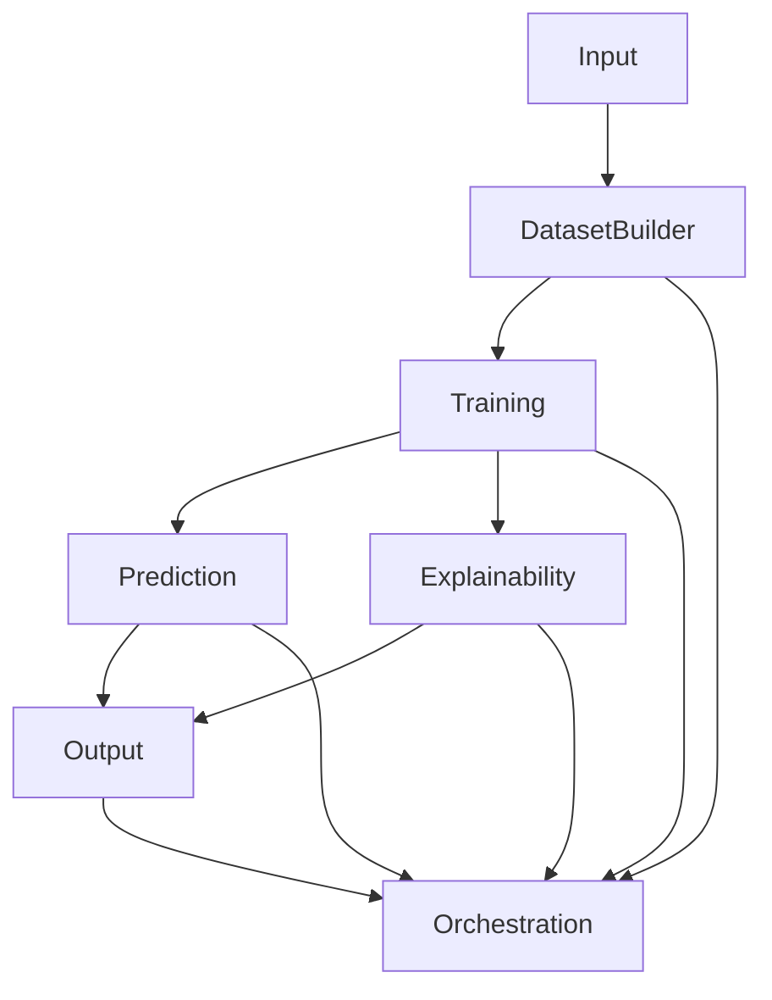

# Architecture Documentation - Protein Embedding Classifier

## 🏗️ Overview

The **Protein Embedding Classifier (PEC)** follows a **modular, layered architecture** designed for:
- **Maintainability** - Clear separation of concerns
- **Extensibility** - Easy to add new functionality
- **Testability** - Isolated modules for unit testing
- **Scalability** - Supports growth in datasets, models, and experiments

---

## 📊 Architecture Diagram

```
┌─────────────────────────────────────────────────────────────────────┐
│                         Protein Embedding Classifier                   │
├─────────────────────────────────────────────────────────────────────┤
│                                                                         │
│  ┌─────────────────────────────────────────────────────────────────┐ │
│  │                        src/ (Core Modules)                         │ │
│  ├──────────────┬──────────────────┬──────────────────┬──────────────┤ │
│  │   Input       │  Dataset Builder │    Training      │  Prediction   │ │
│  │              │                  │                  │              │ │
│  │ • CSVLoader   │ • DatasetBuilder │ • get_classifier │ • Predictor   │ │
│  │ • DBLoader    │ • RunLoader      │ • BaseClassifier │ • BatchPredict│ │
│  │ • APILoader   │ • LabelLoader    │ • Trainer        │ or           │ │
│  │ • ProteinLoader│ • load_run       │ • LossFactory    │              │ │
│  │ • Validators  │ • list_runs      │ • MetricFactory  │              │ │
│  │ • Normalizer  │ • contracts      │ • WandbIntegration│              │ │
│  └──────────────┴──────────────────┴──────────────────┴──────────────┘ │
│                                                                         │
│  ┌─────────────────────────────────────────────────────────────────┐ │
│  │                      src/ (Support Modules)                        │ │
│  ├──────────────────┬──────────────────┬──────────────────┤          │ │
│  │  Explainability   │     Output       │   Orchestration   │          │ │
│  │                  │                  │                  │          │ │
│  │ • FeatureImportance│ • ResultsManager│ • ExperimentRunner│          │ │
│  │ • EmbeddingSaliency│ • CSVWriter     │ • SweepManager    │          │ │
│  │ • Plotter        │ • JSONWriter     │ • BenchmarkManager │          │ │
│  │                  │ • ReportWriter   │                  │          │ │
│  └──────────────────┴──────────────────┴──────────────────┘          │ │
│                                                                         │
└─────────────────────────────────────────────────────────────────────┘
                                                                         
┌─────────────────────────────────────────────────────────────────────┐
│                      External Dependencies                            │
├─────────────────────────────────────────────────────────────────────┤
│  • pandas           • numpy            • scikit-learn     • torch     │
│  • wandb            • sqlalchemy       • psycopg2         • xgboost   │
│  • yaml             • matplotlib       • seaborn          • requests  │
└─────────────────────────────────────────────────────────────────────┘
```

---

## 🏗️ Module Architecture

### 1. Input Module (`src/input/`)

**Responsibility:** Load and validate raw data from various sources.

```
src/input/
├── __init__.py          # Public API exports
├── csv_loader.py        # CSV file loading
├── db_loader.py         # Database loading
├── api_loader.py        # API data loading
├── protein_loader.py    # Protein-specific loading
├── reader.py            # Universe reader (for TP-NTP pairs)
├── normalizer.py        # Data normalization
├── validators.py        # Data validation utilities
└── models.py            # Data models (InputConfig, etc.)
```

**Key Classes:**
- `CSVLoader` - Load CSV files
- `DatabaseLoader` - Load from SQL databases
- `APILoader` - Load from bioinformatics APIs
- `ProteinLoader` - Load protein-specific data
- `UniverseReader` - Read TP-NTP universe files
- `UniverseNormalizer` - Normalize universe records
- `DataValidator` - Validate data structure and content

**Dependencies:** None (external: pandas, numpy)

---

### 2. Dataset Builder Module (`src/dataset_builder/`)

**Responsibility:** Construct and manage datasets from raw data and embeddings.

```
src/dataset_builder/
├── __init__.py              # Public API exports
├── builders/
│   └── dataset_builder.py   # Main dataset builder
├── generators/
│   └── generator.py         # Dataset variant generator
├── export/
│   ├── __init__.py          # Export API
│   └── exporter.py          # Dataset exporter
├── lineage/
│   ├── __init__.py          # Lineage API
│   └── builder.py           # Lineage builder
├── policies/
│   ├── __init__.py          # Policies API
│   ├── validator.py         # Policy validator
│   └── models.py            # Policy models
├── splits/
│   ├── __init__.py          # Splits API
│   ├── base.py              # Base split strategy
│   ├── strategies.py        # Split strategies
│   ├── cross_validation.py  # Cross-validation splits
│   ├── independent.py       # Independent train/test splits
│   ├── zero_shot_csv.py     # Zero-shot CSV splits
│   ├── zero_shot_organism.py # Zero-shot organism splits
│   └── zero_shot_random.py  # Zero-shot random splits
├── run_loader.py            # Run loading utilities
├── label_loader.py          # Label loading
├── contracts.py             # Dataset contracts
└── models.py                # Dataset models (UniverseRecord, etc.)
```

**Key Classes:**
- `DatasetBuilder` - Build datasets from configurations
- `RunLoader` - Load dataset designer runs
- `DatasetVariantGenerator` - Generate dataset variants
- `BundleExporter` - Export dataset bundles
- `LineageBuilder` - Build dataset lineage
- `PolicyValidator` - Validate dataset policies
- `SplitStrategy` - Base class for split strategies

**Dependencies:** Input Module, pandas, numpy

---

### 3. Training Module (`src/training/`)

**Responsibility:** Train models on datasets.

```
src/training/
├── __init__.py              # Public API exports
├── models/
│   ├── __init__.py          # Models API
│   ├── base.py              # Base classifier
│   ├── base_classifier.py   # Base classifier (from old code)
│   ├── mlp_protein_classifier.py # MLP classifier
│   ├── linear.py            # Linear classifier
│   ├── linear_classifier.py # Linear classifier (from old code)
│   ├── random_forest.py     # Random Forest classifier
│   └── random_forest_classifier.py # Random Forest (from old code)
├── losses.py                # Loss functions
├── metrics.py               # Evaluation metrics
├── train_loop.py            # Training loop
├── wandb_integration.py     # W&B integration
├── embedding_handler.py     # Embedding handling
├── embedding_loading.py      # Embedding loading
├── embeddings.py             # Embedding utilities
├── decision/
│   └── decision_policy.py    # Decision policies
├── statistics/
│   ├── __init__.py          # Statistics API
│   ├── friedman_test.py     # Friedman statistical test
│   ├── nemenyi_test.py      # Nemenyi statistical test
│   └── ranking_utils.py      # Ranking utilities
├── ensemble/
│   └── soft_voting_service.py # Soft voting ensemble
├── layer_aggregation/
│   ├── __init__.py          # Layer aggregation API
│   ├── attention.py         # Attention aggregation
│   ├── base.py              # Base aggregation
│   └── mean.py              # Mean aggregation
├── pipeline.py              # Training pipeline
├── experiment.py             # Experiment utilities
├── tracking.py               # Experiment tracking
└── logging_config.py         # Logging configuration
```

**Key Classes:**
- `BaseClassifier` - Base class for all classifiers
- `MLPProteinClassifier` - MLP classifier for protein embeddings
- `LinearClassifier` - Logistic regression classifier
- `RandomForestClassifier` - Random Forest classifier
- `Trainer` - Training loop implementation
- `WandbIntegration` - W&B logging integration
- `LossFactory` - Factory for loss functions
- `MetricFactory` - Factory for evaluation metrics

**Dependencies:** Dataset Builder, scikit-learn, torch, wandb

---

### 4. Prediction Module (`src/prediction/`)

**Responsibility:** Make predictions using trained models.

```
src/prediction/
├── __init__.py          # Public API exports
└── predictor.py         # Predictor implementation
```

**Key Classes:**
- `Predictor` - Single prediction handler
- `BatchPredictor` - Batch prediction handler

**Key Functions:**
- `predict(model, data)` - Make a prediction
- `batch_predict(model, data_list)` - Make batch predictions

**Dependencies:** Training Module, numpy, pandas

---

### 5. Explainability Module (`src/explainability/`)

**Responsibility:** Interpret and explain model predictions.

```
src/explainability/
├── __init__.py              # Public API exports
├── feature_importance.py    # Feature importance analysis
├── embedding_saliency.py    # Embedding saliency maps
└── visualization/
    ├── __init__.py          # Visualization API
    └── plotter.py           # Plotting utilities
```

**Key Classes:**
- `FeatureImportance` - Calculate feature importance
- `EmbeddingSaliency` - Generate saliency maps
- `Plotter` - Create visualizations

**Key Functions:**
- `explain(model, data, method)` - Generate explanations
- `visualize(explanation, plot_type)` - Visualize explanations

**Dependencies:** Training Module, numpy, matplotlib

---

### 6. Output Module (`src/output/`)

**Responsibility:** Save and manage results.

```
src/output/
├── __init__.py              # Public API exports
├── results_manager.py      # Results management
└── writers/
    ├── __init__.py          # Writers API
    ├── csv_writer.py        # CSV writer
    ├── json_writer.py       # JSON writer
    └── report_writer.py     # Report writer
```

**Key Classes:**
- `ResultsManager` - Manage results saving
- `CSVWriter` - Write CSV files
- `JSONWriter` - Write JSON files
- `ReportWriter` - Generate reports

**Key Functions:**
- `save_results(results, path, format)` - Save results in specified format
- `generate_report(results, template)` - Generate a report

**Dependencies:** pandas, json

---

### 7. Orchestration Module (`src/orchestration/`)

**Responsibility:** Manage experiments, sweeps, and benchmarks.

```
src/orchestration/
├── __init__.py                  # Public API exports
├── experiment_runner.py        # Experiment runner
├── experiment_definitions.py   # Experiment definitions
├── sweep_manager.py            # Sweep manager
└── benchmark_manager.py        # Benchmark manager
```

**Key Classes:**
- `ExperimentRunner` - Run individual experiments
- `ExperimentDefinitions` - Define available experiments
- `SweepManager` - Manage hyperparameter sweeps
- `BenchmarkManager` - Run benchmark comparisons

**Key Functions:**
- `run_experiment(name, config)` - Run a single experiment
- `run_sweep(config)` - Run a hyperparameter sweep
- `run_benchmark(config)` - Run a benchmark comparison

**Dependencies:** All other modules

---

## 🔄 Data Flow

### Main Data Pipeline

```
┌─────────────┐     ┌─────────────────┐     ┌─────────────┐
│  Raw Data    │────▶│  Input Module    │────▶│ Dataset     │
│ (CSV, DB, API)│     │ (Load & Validate)│     │ Builder     │
└─────────────┘     └─────────────────┘     │ (Construct)  │
                                              └──────┬──────┘
                                                     │
                                                     ▼
┌─────────────────────────────────────────────────────────────────┐
│                        Dataset (TP-NTP Pairs)                        │
└─────────────────────────────────────────────────────────────────┘
                                     │
                                     ▼
┌─────────────────────────────────────────────────────────────────┐
│                        Training Module                               │
│  ┌─────────────┐    ┌─────────────┐    ┌─────────────────────────┐  │
│  │  Model      │    │  Training   │    │  Validation & Metrics    │  │
│  │ Selection   │───▶│  Loop       │───▶│                         │  │
│  └─────────────┘    └─────────────┘    └─────────────────────────┘  │
└─────────────────────────────────────────────────────────────────┘
                                     │
                                     ▼
┌─────────────────────────────────────────────────────────────────┐
│                        Trained Model                                 │
└─────────────────────────────────────────────────────────────────┘
                                     │
              ┌──────────────────────┬──────────────────────┐
              │                      │                      │
              ▼                      ▼                      ▼
┌─────────────────────┐  ┌─────────────────────┐  ┌─────────────────────┐
│  Prediction Module   │  │ Explainability Module│  │   Output Module      │
│ (Make Predictions)   │  │ (Interpret Model)    │  │ (Save Results)       │
└─────────────────────┘  └─────────────────────┘  └─────────────────────┘
                                     │
                                     ▼
┌─────────────────────────────────────────────────────────────────┐
│                        Results & Reports                            │
└─────────────────────────────────────────────────────────────────┘
```

### Experiment Orchestration Flow

```
┌─────────────────────────────────────────────────────────────────┐
│                    Orchestration Module                             │
│  ┌─────────────────────┐  ┌─────────────────────┐                  │
│  │  ExperimentRunner    │  │    SweepManager      │                  │
│  │                     │  │                     │                  │
│  │ • run_experiment()   │  │ • run_sweep()        │                  │
│  │ • Single experiment │  │ • Hyperparameter     │                  │
│  │   execution          │  │   optimization       │                  │
│  └─────────────────────┘  └─────────────────────┘                  │
│                                                                     │
│  ┌─────────────────────┐  ┌─────────────────────┐                  │
│  │  BenchmarkManager    │  │ ExperimentDefinitions│                  │
│  │                     │  │                     │                  │
│  │ • run_benchmark()    │  │ • Predefined         │                  │
│  │ • Model comparison   │  │   experiments        │                  │
│  │ • Cross-species      │  │ • Custom experiments │                  │
│  │   comparison         │  │ • Experiment registry │                  │
│  └─────────────────────┘  └─────────────────────┘                  │
└─────────────────────────────────────────────────────────────────┘
                                     │
                                     ▼
┌─────────────────────────────────────────────────────────────────┐
│                    Dataset Builder + Training                       │
│                    (Reuses existing modules)                        │
└─────────────────────────────────────────────────────────────────┘
```

---

## 🔌 Module Dependencies

### Dependency Graph



### Dependency Table

| Module | Dependencies | Reverse Dependencies |
|--------|--------------|----------------------|
| **Input** | None | Dataset Builder |
| **Dataset Builder** | Input | Training, Orchestration |
| **Training** | Dataset Builder | Prediction, Explainability, Orchestration |
| **Prediction** | Training | Orchestration, Output |
| **Explainability** | Training | Orchestration, Output |
| **Output** | None | Prediction, Explainability, Orchestration |
| **Orchestration** | All modules | None |

---

## 📦 Configuration Structure

### Directory Structure

```
configs/
├── datasets/                    # Dataset configurations
│   ├── humans.yaml              # Humans dataset config
│   ├── model_organisms.yaml     # Model organisms config
│   └── template.yaml            # Dataset config template
│
├── models/                      # Model configurations
│   ├── mlp.yaml                 # MLP configuration
│   ├── random_forest.yaml       # Random Forest configuration
│   └── template.yaml            # Model config template
│
├── experiments/                 # Experiment configurations
│   ├── benchmark.yaml           # Benchmark configuration
│   ├── cross_species.yaml       # Cross-species configuration
│   ├── runs_config.yaml         # Runs configuration
│   └── template.yaml            # Experiment config template
│
└── sweeps/                      # Hyperparameter sweep configurations
    ├── mlp_sweep.yaml           # MLP sweep configuration
    ├── rf_sweep.yaml            # Random Forest sweep
    └── template.yaml            # Sweep config template
```

### Configuration Loading

```python
import yaml

# Load a configuration file
with open('configs/experiments/training_config.yaml', 'r') as f:
    config = yaml.safe_load(f)

# Access configuration values
print(config['training']['learning_rate'])
print(config['evaluation']['test_size'])
```

---

## 🎯 Design Principles

### 1. Single Responsibility Principle

Each module has a single, well-defined responsibility:
- **Input:** Load data
- **Dataset Builder:** Build datasets
- **Training:** Train models
- **Prediction:** Make predictions
- **Explainability:** Explain predictions
- **Output:** Save results
- **Orchestration:** Manage experiments

### 2. Separation of Concerns

- **Data loading** is separate from **data processing**
- **Model training** is separate from **model inference**
- **Business logic** is separate from **I/O operations**
- **Configuration** is separate from **execution**

### 3. Dependency Injection

Modules accept their dependencies as parameters rather than creating them internally:

```python
# Good: Dependency injected
class Trainer:
    def __init__(self, model: BaseClassifier, data_loader: DataLoader):
        self.model = model
        self.data_loader = data_loader

# Bad: Dependency created internally
class Trainer:
    def __init__(self):
        self.model = get_classifier('mlp')  # Hard-coded dependency
        self.data_loader = CSVLoader()       # Hard-coded dependency
```

### 4. Interface Segregation

Modules expose minimal, focused interfaces:

```python
# Good: Minimal interface
class Predictor:
    def predict(self, data):
        """Make a prediction."""
        pass

# Bad: Overloaded interface
class Predictor:
    def predict(self, data):
        pass
    def train(self, data, labels):  # Training doesn't belong here
        pass
    def save(self, path):          # Saving doesn't belong here
        pass
```

### 5. Open/Closed Principle

Modules are open for extension but closed for modification:

```python
# Good: Extensible through inheritance
class BaseClassifier(ABC):
    @abstractmethod
    def fit(self, X, y):
        pass
    
    @abstractmethod
    def predict(self, X):
        pass

class MLPClassifier(BaseClassifier):
    def fit(self, X, y):
        # MLP-specific implementation
        pass
    
    def predict(self, X):
        # MLP-specific implementation
        pass

# Bad: Requires modification for extension
class Classifier:
    def fit(self, X, y):
        if self.type == 'mlp':
            # MLP implementation
            pass
        elif self.type == 'rf':
            # RF implementation
            pass
```

---

## 📊 Performance Considerations

### Memory Management

- Use generators for large datasets
- Load data in batches when possible
- Use efficient data structures (numpy arrays, pandas DataFrames)
- Clean up resources after use

### Computation Efficiency

- Vectorize operations with numpy
- Use GPU acceleration for deep learning models
- Cache expensive computations
- Use parallel processing for independent tasks

### I/O Optimization

- Use efficient file formats (Parquet, HDF5 for large datasets)
- Compress data when possible
- Minimize I/O operations in hot loops
- Use buffering for file operations

---

## 🔧 Extensibility Guide

### Adding a New Data Source

1. Create a new loader class in `src/input/`:

```python
# src/input/my_data_loader.py
from src.input import DataLoader

class MyDataLoader(DataLoader):
    def load(self, source, **kwargs):
        # Implement loading logic
        pass
```

2. Export it in `src/input/__init__.py`:

```python
from .my_data_loader import MyDataLoader

__all__ = [
    # ... existing exports
    'MyDataLoader',
]
```

3. Use it:

```python
from src.input import MyDataLoader

loader = MyDataLoader()
data = loader.load('my_data_source')
```

### Adding a New Model

1. Create a new classifier class in `src/training/models/`:

```python
# src/training/models/my_classifier.py
from src.training.models.base import BaseClassifier

class MyClassifier(BaseClassifier):
    def fit(self, X, y):
        # Implement training
        pass
    
    def predict(self, X):
        # Implement prediction
        pass
```

2. Register it in the classifier registry:

```python
# src/training/models/registry.py
from .my_classifier import MyClassifier

CLASSIFIERS = {
    # ... existing classifiers
    'my_classifier': MyClassifier,
}
```

3. Use it:

```python
from src.training import get_classifier

model = get_classifier('my_classifier')
```

### Adding a New Split Strategy

1. Create a new split strategy in `src/dataset_builder/splits/`:

```python
# src/dataset_builder/splits/my_split.py
from src.dataset_builder.splits.base import SplitStrategy

class MySplitStrategy(SplitStrategy):
    def split(self, data, **kwargs):
        # Implement splitting logic
        pass
```

2. Export it in `src/dataset_builder/splits/__init__.py`:

```python
from .my_split import MySplitStrategy

__all__ = [
    # ... existing exports
    'MySplitStrategy',
]
```

3. Use it:

```python
from src.dataset_builder.splits import MySplitStrategy

strategy = MySplitStrategy()
train, test = strategy.split(dataset)
```

### Adding a New Explainability Method

1. Create a new explainer class in `src/explainability/`:

```python
# src/explainability/my_explainer.py
from src.explainability import Explainer

class MyExplainer(Explainer):
    def explain(self, model, data, **kwargs):
        # Implement explanation logic
        pass
```

2. Register it in `src/explainability/__init__.py`:

```python
from .my_explainer import MyExplainer

explainers = {
    # ... existing explainers
    'my_method': MyExplainer,
}
```

3. Use it:

```python
from src.explainability import explain

explanation = explain(model, data, method='my_method')
```

---

## 📚 API Documentation

For detailed API documentation, see [API.md](API.md).

---

## 🏁 Conclusion

The PEC architecture provides a **clean, modular foundation** for protein classification research. By following the design principles and patterns described in this document, you can:

- ✅ **Extend** the system with new functionality
- ✅ **Maintain** the codebase over time
- ✅ **Test** components in isolation
- ✅ **Scale** to larger datasets and more complex experiments

For questions or clarifications, please refer to the [main README](../README.md) or open a GitHub issue.

---

**Last Updated:** 2026-08-03  
**Version:** 1.0  
**Maintainers:** Protein Embedding Classifier Team
