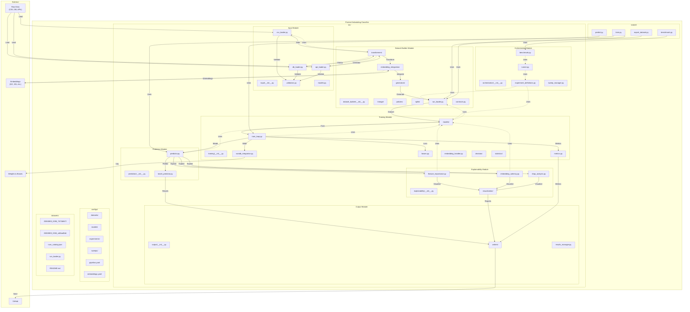
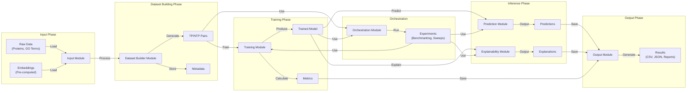
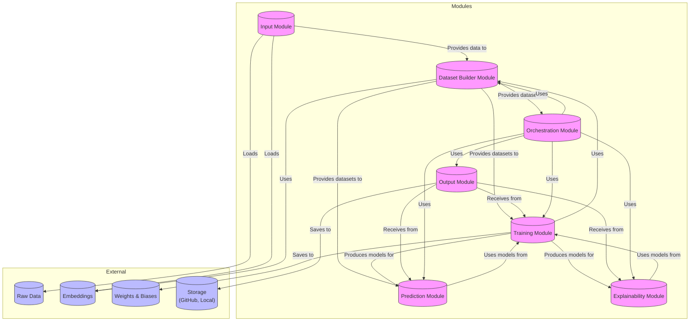
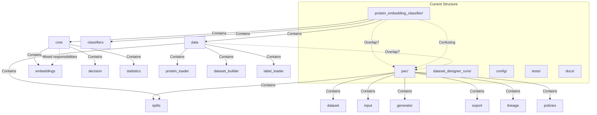
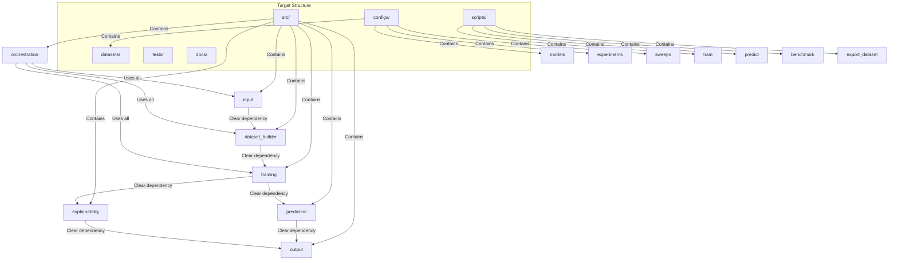
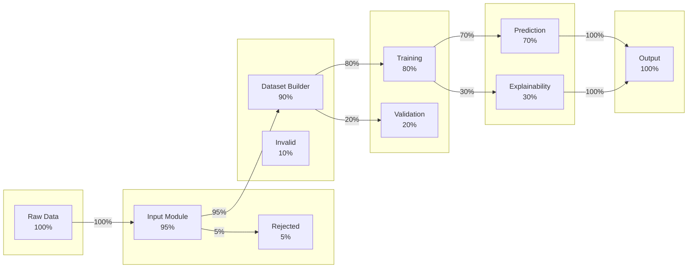

# Architecture Diagrams - Protein Embedding Classifier

## 📊 Visual Architecture Overview

This document contains visual diagrams of the proposed architecture for the Protein Embedding Classifier project.

---

## 🏗️ 1. Target Module Architecture (Mermaid)



---

## 🔄 2. Data Flow Diagram



---

## 📦 3. Module Dependencies Diagram



---

## 🗺️ 4. Current vs Target Architecture Comparison

### 4.1 Current Architecture



### 4.2 Target Architecture



---

## 🏗️ 5. Class Diagram (Key Classes)

```mermaid
classDiagram
    %% Input Module
    class CSVLoader {
        +load(file_path: str) DataFrame
        +validate(data: DataFrame) bool
    }
    
    class DatabaseLoader {
        +connect(db_url: str)
        +query(sql: str) DataFrame
    }
    
    class DataValidator {
        +validate_schema(data: DataFrame) bool
        +check_nulls(data: DataFrame) bool
    }
    
    %% Dataset Builder Module
    class DatasetBuilder {
        +build_dataset(config: dict) Dataset
        +apply_transformations(data: DataFrame) DataFrame
    }
    
    class EmbeddingIntegrator {
        +integrate_embeddings(dataset: Dataset, embeddings: dict) Dataset
        +pool_embeddings(embeddings: list) array
    }
    
    class DatasetGenerator {
        +generate_pairs(tp_proteins: list, ntp_proteins: list) Dataset
        +create_splits(dataset: Dataset, strategy: str) dict
    }
    
    %% Training Module
    class ModelRegistry {
        +register_model(name: str, model_class: type)
        +get_model(name: str) BaseModel
        +list_models() list
    }
    
    class BaseModel {
        <<abstract>>
        +train(X: array, y: array) None
        +predict(X: array) array
        +save(path: str) None
        +load(path: str) BaseModel
    }
    
    class MLPModel {
        +train(X: array, y: array) None
        +predict(X: array) array
    }
    
    class Trainer {
        +train_model(model: BaseModel, data: Dataset, config: dict) TrainedModel
        +validate(model: BaseModel, data: Dataset) dict
    }
    
    %% Prediction Module
    class Predictor {
        +predict(model: BaseModel, data: DataFrame) DataFrame
        +predict_proba(model: BaseModel, data: DataFrame) DataFrame
    }
    
    class BatchPredictor {
        +predict_batch(model: BaseModel, data: list) list
    }
    
    %% Explainability Module
    class Explainer {
        <<abstract>>
        +explain(model: BaseModel, data: DataFrame) dict
    }
    
    class FeatureImportance {
        +explain(model: BaseModel, data: DataFrame) dict
    }
    
    class EmbeddingSaliency {
        +explain(model: BaseModel, embeddings: array) dict
    }
    
    %% Output Module
    class ResultsWriter {
        +write_csv(data: DataFrame, path: str) None
        +write_json(data: dict, path: str) None
    }
    
    class ReportGenerator {
        +generate_report(results: dict, template: str) str
    }
    
    %% Orchestration Module
    class ExperimentRunner {
        +run_experiment(config: dict) dict
        +run_benchmark(config: dict) dict
    }
    
    class SweepManager {
        +run_sweep(config: dict) list
    }
    
    %% Relationships
    CSVLoader <|-- DatabaseLoader
    DatasetBuilder o-- EmbeddingIntegrator
    DatasetBuilder o-- DatasetGenerator
    BaseModel <|-- MLPModel
    ModelRegistry o-- BaseModel
    Trainer o-- BaseModel
    Predictor o-- BaseModel
    BatchPredictor o-- Predictor
    Explainer <|-- FeatureImportance
    Explainer <|-- EmbeddingSaliency
    ExperimentRunner o-- Trainer
    ExperimentRunner o-- Predictor
    ExperimentRunner o-- Explainer
```



---

## 📁 6. File Structure Tree (Text Representation)

```
protein-embedding-classifier/
├── src/
│   ├── __init__.py
│   │
│   ├── input/
│   │   ├── __init__.py
│   │   ├── csv_loader.py
│   │   ├── db_loader.py
│   │   ├── api_loader.py
│   │   ├── validators.py
│   │   └── models.py
│   │
│   ├── dataset_builder/
│   │   ├── __init__.py
│   │   ├── transformers/
│   │   │   ├── __init__.py
│   │   │   ├── normalizer.py
│   │   │   └── filter.py
│   │   ├── embedding_integration/
│   │   │   ├── __init__.py
│   │   │   ├── pooling.py
│   │   │   └── concatenator.py
│   │   ├── generators/
│   │   │   ├── __init__.py
│   │   │   └── target_non_target.py
│   │   ├── lineage/
│   │   │   ├── __init__.py
│   │   │   ├── builder.py
│   │   │   └── models.py
│   │   ├── policies/
│   │   │   ├── __init__.py
│   │   │   ├── validator.py
│   │   │   └── models.py
│   │   ├── splits/
│   │   │   ├── __init__.py
│   │   │   ├── strategies.py
│   │   │   └── models.py
│   │   ├── run_loader.py
│   │   ├── contracts.py
│   │   └── label_loader.py
│   │
│   ├── training/
│   │   ├── __init__.py
│   │   ├── models/
│   │   │   ├── __init__.py
│   │   │   ├── base.py
│   │   │   ├── mlp.py
│   │   │   ├── random_forest.py
│   │   │   ├── linear.py
│   │   │   └── xgboost.py
│   │   ├── train_loop.py
│   │   ├── wandb_integration.py
│   │   ├── losses.py
│   │   ├── metrics.py
│   │   ├── embedding_handler.py
│   │   ├── decision/
│   │   │   ├── __init__.py
│   │   │   └── decision_policy.py
│   │   └── statistics/
│   │       ├── __init__.py
│   │       ├── friedman_test.py
│   │       ├── nemenyi_test.py
│   │       └── ranking_utils.py
│   │
│   ├── prediction/
│   │   ├── __init__.py
│   │   ├── predictor.py
│   │   └── batch_predictor.py
│   │
│   ├── explainability/
│   │   ├── __init__.py
│   │   ├── feature_importance.py
│   │   ├── embedding_saliency.py
│   │   ├── shap_analysis.py
│   │   └── visualization/
│   │       ├── __init__.py
│   │       └── plotter.py
│   │
│   ├── output/
│   │   ├── __init__.py
│   │   ├── writers/
│   │   │   ├── __init__.py
│   │   │   ├── csv_writer.py
│   │   │   ├── json_writer.py
│   │   │   └── report_writer.py
│   │   └── results_manager.py
│   │
│   └── orchestration/
│       ├── __init__.py
│       ├── experiment_definitions.py
│       ├── runner.py
│       ├── sweep_manager.py
│       └── benchmark.py
│
├── configs/
│   ├── datasets/
│   │   ├── humans.yaml
│   │   ├── model_organisms.yaml
│   │   └── template.yaml
│   ├── models/
│   │   ├── mlp.yaml
│   │   ├── random_forest.yaml
│   │   └── template.yaml
│   ├── experiments/
│   │   ├── benchmark.yaml
│   │   ├── cross_species.yaml
│   │   └── template.yaml
│   ├── sweeps/
│   │   ├── mlp_sweep.yaml
│   │   ├── rf_sweep.yaml
│   │   └── xgb_sweep.yaml
│   ├── pipeline.yaml
│   └── embeddings.yaml
│
├── datasets/
│   ├── 20260803_0258_7672b947/
│   │   ├── final_dataset.csv
│   │   ├── run_metadata.json
│   │   ├── pipeline.log
│   │   └── ...
│   ├── 20260803_0304_a68aa0bb/
│   │   ├── final_dataset.csv
│   │   ├── run_metadata.json
│   │   └── ...
│   ├── README.md
│   ├── run_loader.py
│   └── runs_catalog.json
│
├── scripts/
│   ├── __init__.py
│   ├── train.py
│   ├── predict.py
│   ├── benchmark.py
│   └── export_dataset.py
│
├── tests/
│   ├── __init__.py
│   ├── unit/
│   │   ├── __init__.py
│   │   ├── test_input.py
│   │   ├── test_dataset_builder.py
│   │   ├── test_training.py
│   │   ├── test_prediction.py
│   │   ├── test_explainability.py
│   │   └── test_output.py
│   ├── integration/
│   │   ├── __init__.py
│   │   ├── test_pipeline.py
│   │   └── test_orchestration.py
│   └── fixtures/
│       └── test_data.py
│
├── docs/
│   ├── ARCHITECTURE.md
│   ├── USAGE.md
│   ├── API.md
│   ├── CONTRIBUTING.md
│   ├── TERMINOLOGY.md
│   ├── ARCHITECTURE_REFACTORING_PROPOSAL.md
│   ├── REFACTORING_30H_PLAN.md
│   └── examples/
│       ├── train_model.py
│       ├── make_prediction.py
│       └── run_benchmark.py
│
├── notebooks/
│   ├── exploration/
│   ├── analysis/
│   └── examples/
│
├── .github/
│   └── workflows/
│       ├── ci.yml
│       ├── test.yml
│       └── docs.yml
│
├── pyproject.toml
├── poetry.lock
├── README.md
└── .gitignore
```

---

## 🎯 7. Data Flow Sankey Diagram



---

## 📝 How to Use These Diagrams

### For Documentation
1. Copy the Mermaid code into any Markdown file
2. GitHub will render it automatically
3. For local viewing, use a Mermaid-compatible editor (VS Code with Mermaid plugin, Obsidian, etc.)

### For Presentations
1. Use Mermaid Live Editor: [https://mermaid.live](https://mermaid.live)
2. Copy the diagram code
3. Customize as needed
4. Export as SVG/PNG

### For Development
1. Use these diagrams as reference when implementing
2. Update diagrams as the architecture evolves
3. Keep diagrams in sync with actual code structure

---

## 🔗 Related Documents

- [Architecture Refactoring Proposal](ARCHITECTURE_REFACTORING_PROPOSAL.md)
- [30-Hour Refactoring Plan](REFACTORING_30H_PLAN.md)
- [Terminology Clarification](../TERMINOLOGY_CLARIFICATION.md)

---

**Document Status:** ✅ Complete  
**Last Updated:** 2026-08-03  
**Version:** 1.0  
**Author:** PEC Architecture Team
